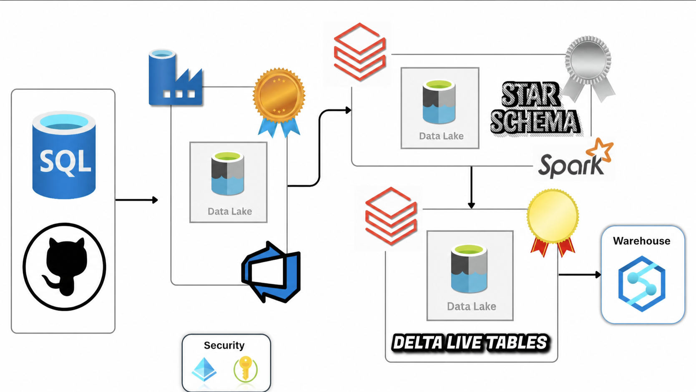
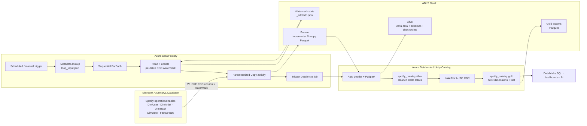

# Spotify Azure Incremental Lakehouse

[](https://azure.microsoft.com/products/azure-sql/database)
[](https://azure.microsoft.com/products/data-factory)
[](https://azure.microsoft.com/products/storage/data-lake-storage)
[](https://www.databricks.com/)
[](https://delta.io/)

An end-to-end Spotify-style analytics lakehouse on Azure. **Azure Data Factory** incrementally extracts user, artist, track, date, and streaming activity data from **Microsoft Azure SQL Database** into **Azure Data Lake Storage Gen2**. **Azure Databricks** then uses Auto Loader, PySpark, Delta Lake, and Lakeflow CDC flows to clean the data and publish an analytics-ready star schema.

> The project demonstrates metadata-driven incremental ingestion, persisted watermarks, parameterized ADF datasets, medallion architecture, schema evolution, SCD Type 2 dimensions, data-quality expectations, and Databricks Asset Bundle deployment structure.



## Architecture



For expanded diagrams, see [Architecture](docs/ARCHITECTURE.md). The watermark algorithm is documented in [Incremental ingestion](docs/INCREMENTAL_INGESTION.md), and the analytical schema is described in [Data model](docs/DATA_MODEL.md).

## Pipeline highlights

- Metadata-driven ingestion loops across five SQL tables without duplicating Copy activities.
- Each table defines its schema, name, CDC column, and optional starting watermark in `loop_input.json`.
- ADF reads the previous watermark from ADLS and extracts only rows newer than it.
- Incremental batches are written as Snappy-compressed Parquet to table-specific Bronze folders.
- Empty outputs are deleted instead of leaving zero-row extract files.
- Successful extracts update each table's `cdc.json` watermark.
- ADF triggers Databricks after the complete table loop finishes.
- Auto Loader incrementally discovers Bronze Parquet and supports additive schema evolution.
- Silver transformations normalize user and track fields and persist Delta tables.
- Gold tracks user, artist, track, and date history with SCD Type 2.
- Gold processes `FactStream` as SCD Type 1 and rejects missing business keys.

## End-to-end flow

1. ADF reads `loop_input.json` from the Bronze control folder.
2. A sequential `ForEach` processes `DimUser`, `DimTrack`, `DimDate`, `DimArtist`, and `FactStream`.
3. For each table, ADF reads the last persisted watermark and records the current run timestamp.
4. A dynamic SQL query selects rows whose CDC column is newer than the configured or stored watermark.
5. ADF writes the result as a timestamped Parquet file in `bronze/<table>`.
6. If no data was extracted, the empty output is deleted. Otherwise ADF queries the source maximum CDC value and updates `<table>_cdc/cdc.json`.
7. After all tables complete, ADF invokes the configured Databricks job.
8. Auto Loader processes new Parquet files into Silver Delta tables using persistent schemas and checkpoints.
9. Lakeflow Gold pipelines validate required keys and apply SCD Type 2 or Type 1 logic.
10. Curated tables can be queried directly or exported to the ADLS Gold container.

## Technology stack

| Layer | Technology | Purpose |
|---|---|---|
| Source | Azure SQL Database | Stores Spotify-style users, artists, tracks, dates, and streams |
| Orchestration | Azure Data Factory | Runs metadata-driven incremental ingestion |
| Bronze storage | ADLS Gen2 + Parquet | Stores immutable incremental source extracts |
| Incremental state | ADLS JSON | Persists one watermark per table |
| Transformation | PySpark + Auto Loader | Cleans and incrementally processes new files |
| Lakehouse storage | Delta Lake | Persists Silver and Gold tables |
| Pipeline framework | Lakeflow / DLT | Applies expectations and CDC/SCD semantics |
| Governance | Unity Catalog | Organizes `spotify_catalog.silver` and `.gold` tables |
| Deployment | Databricks Asset Bundles | Defines dev and production workspace targets |

## Source tables

| Table | Business key | Incremental column | Description |
|---|---|---|---|
| `DimUser` | `user_id` | `updated_at` | User identity, country, subscription, and effective dates |
| `DimArtist` | `artist_id` | `updated_at` | Artist name, genre, and country |
| `DimTrack` | `track_id` | `updated_at` | Track, album, artist, duration, and release information |
| `DimDate` | `date_key` | `date` | Calendar attributes |
| `FactStream` | `stream_id` | `stream_timestamp` | Listening activity, duration, device, user, track, and date |

The repository includes SQL scripts for creating the source schema, loading initial sample data, and generating incremental changes.

## Medallion layers

### Bronze

ADF writes one timestamped Parquet extract per table/run beneath:

```text
abfss://bronze@spotifyadlsdata.dfs.core.windows.net/<Table>/
```

Watermarks are stored separately beneath `<Table>_cdc/cdc.json`, beginning with the repository's example value `1900-01-01`.

### Silver

Auto Loader reads Bronze folders using persistent schema and checkpoint locations. It writes Delta data beneath the Silver container and registers these Unity Catalog tables:

```text
spotify_catalog.silver.DimUser
spotify_catalog.silver.DimArtist
spotify_catalog.silver.DimTrack
spotify_catalog.silver.DimDate
spotify_catalog.silver.FactStream
```

Implemented transformations include:

- Uppercasing `DimUser.user_name`
- Deduplicating users and artists by their business keys
- Replacing hyphens in track names with spaces
- Deriving `durationFlag` as `low`, `medium`, or `high`
- Dropping Auto Loader's `_rescued_data` column before publishing

### Gold

Lakeflow expectations drop rows with missing primary identifiers. User, artist, track, and date dimensions use SCD Type 2, while the stream fact uses Type 1.

An additional notebook builds a Jinja-generated user/track stream join, and another exports Gold tables to ADLS as Parquet.

## Repository structure

```text
.
├── pipeline/
│   ├── incremental_loop.json          # Metadata-driven orchestration
│   └── incremental_ingestion.json     # Parameterized single-table pattern
├── dataset/                           # Parameterized SQL, JSON, and Parquet datasets
├── linkedService/                     # Azure SQL, ADLS, and Databricks connections
├── trigger/Trigger.json               # Example ADF schedule trigger
├── factory/                           # Published ADF factory definitions
├── loop_input.json                    # Table and watermark metadata
├── cdc.json                           # Initial watermark template
├── source_scripts /
│   ├── spotify_initial_load.sql
│   └── spotify_incremental_load.sql
└── spotify_dab/spotify_dab/
    ├── databricks.yml                 # Asset Bundle targets
    ├── src/silver/silver_Dimensions.py
    ├── src/gold/gold_pipeline/transformations/
    ├── src/gold/Saving_gold_layer_to_ADLS.py
    ├── Jinja/jinja_notebook.py
    └── utils/transformations.py
```

## Prerequisites

- Azure subscription
- Azure SQL Database
- Azure Data Factory
- ADLS Gen2 storage account with Bronze, Silver, and Gold containers
- Azure Databricks workspace with Unity Catalog
- Databricks CLI for Asset Bundle deployment
- Managed identity or service principal permissions across ADF, ADLS, SQL, and Databricks

## Deployment overview

### 1. Initialize the source

Run `source_scripts /spotify_initial_load.sql` in Azure SQL Database. It creates and populates the five source tables.

### 2. Prepare ADLS

Create the Bronze, Silver, and Gold containers. Upload:

```text
loop_input.json -> bronze/Database_tables_input/loop_input.json
cdc.json        -> bronze/<Table>_cdc/cdc.json for each table
empty.json      -> the control location expected by the watermark update activity
```

### 3. Deploy Azure Data Factory

Import or publish the linked services, datasets, pipelines, and trigger. Replace repository-specific resource names and connection settings with your environment. Prefer managed identity and Key Vault references for credentials.

### 4. Create Unity Catalog objects

```sql
CREATE CATALOG IF NOT EXISTS spotify_catalog;
CREATE SCHEMA IF NOT EXISTS spotify_catalog.silver;
CREATE SCHEMA IF NOT EXISTS spotify_catalog.gold;
```

### 5. Deploy Databricks code

```bash
cd spotify_dab/spotify_dab
databricks bundle validate -t dev
databricks bundle deploy -t dev
```

The committed bundle currently defines workspace targets but does not declare job or pipeline resources. Add those resources or configure the referenced Databricks job in the workspace.

### 6. Run the pipeline

Trigger `incremental_loop` manually or enable an environment-appropriate schedule. Verify all table iterations succeed before the Databricks job starts.

## Validate results

```sql
-- Silver counts
SELECT 'DimUser' AS table_name, COUNT(*) AS rows FROM spotify_catalog.silver.DimUser
UNION ALL SELECT 'DimArtist', COUNT(*) FROM spotify_catalog.silver.DimArtist
UNION ALL SELECT 'DimTrack', COUNT(*) FROM spotify_catalog.silver.DimTrack
UNION ALL SELECT 'DimDate', COUNT(*) FROM spotify_catalog.silver.DimDate
UNION ALL SELECT 'FactStream', COUNT(*) FROM spotify_catalog.silver.FactStream;

-- Current user versions
SELECT *
FROM spotify_catalog.gold.dimuser
WHERE __END_AT IS NULL;

-- Listening time by subscription
SELECT
  u.subscription_type,
  COUNT(*) AS streams,
  SUM(f.listen_duration) AS total_listen_duration
FROM spotify_catalog.gold.factstream AS f
JOIN spotify_catalog.gold.dimuser AS u
  ON f.user_id = u.user_id
 AND u.__END_AT IS NULL
GROUP BY u.subscription_type
ORDER BY total_listen_duration DESC;
```

## Analytics use cases

- Streams and listening duration by artist, track, genre, country, or subscription tier
- Device usage by customer segment
- Track engagement by duration category
- New versus changing users and artists over time
- Current and historical subscription-type analysis
- Daily, monthly, and yearly streaming trends
- Most-played tracks and top artists

## Recommended production improvements

- Use a half-open watermark window (`> previous` and `<= captured upper bound`) to avoid missing rows that arrive while extraction runs.
- Update the persisted watermark to the extracted upper bound, not an independently queried later maximum.
- Parameterize storage accounts, catalogs, job IDs, SQL resources, and workspace hosts by environment.
- Add ADF retries, alerts, secure input/output, and audit logging.
- Use Key Vault or managed identity instead of embedded connection metadata.
- Add Silver expectations, fact/dimension relationship tests, duplicate checks, and reconciliation metrics.
- Declare Databricks jobs and Lakeflow pipelines in the Asset Bundle.
- Replace overwrite-based Gold exports with an incremental or partitioned publication strategy when data volume grows.

## Documentation

- [Architecture and orchestration flow](docs/ARCHITECTURE.md)
- [Incremental ingestion and watermarks](docs/INCREMENTAL_INGESTION.md)
- [Gold star schema](docs/DATA_MODEL.md)
- [Deployment and operations](docs/DEPLOYMENT.md)
- [Portfolio-ready project summary](docs/PROJECT_SHOWCASE.md)

## Author

**Adarsh Damarla** · [GitHub](https://github.com/AdarshDamarla-Git)

