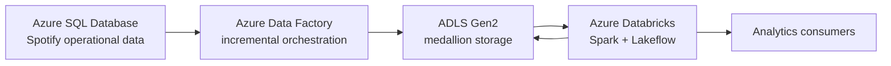
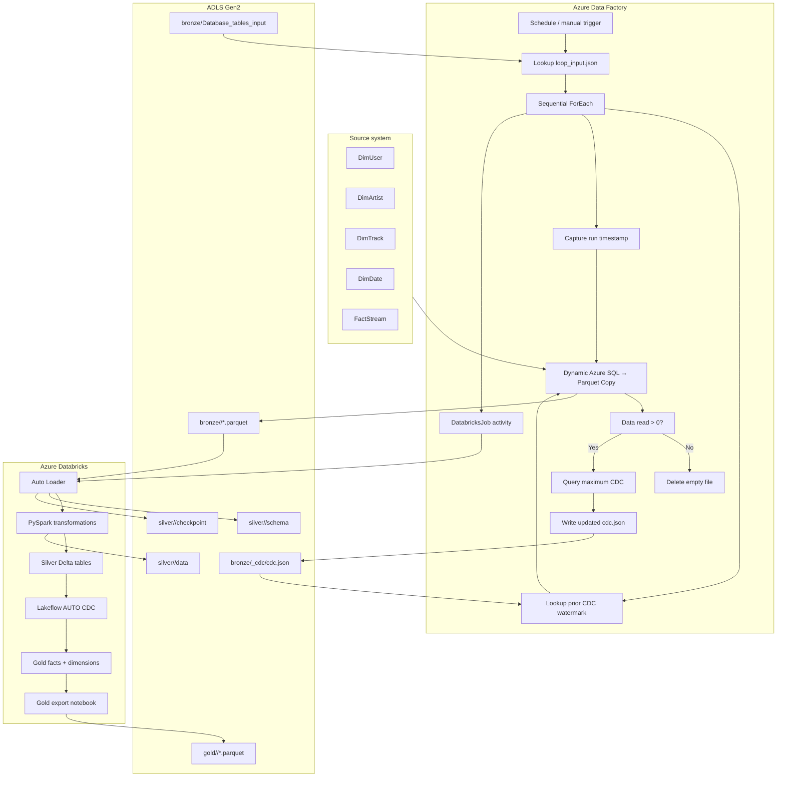
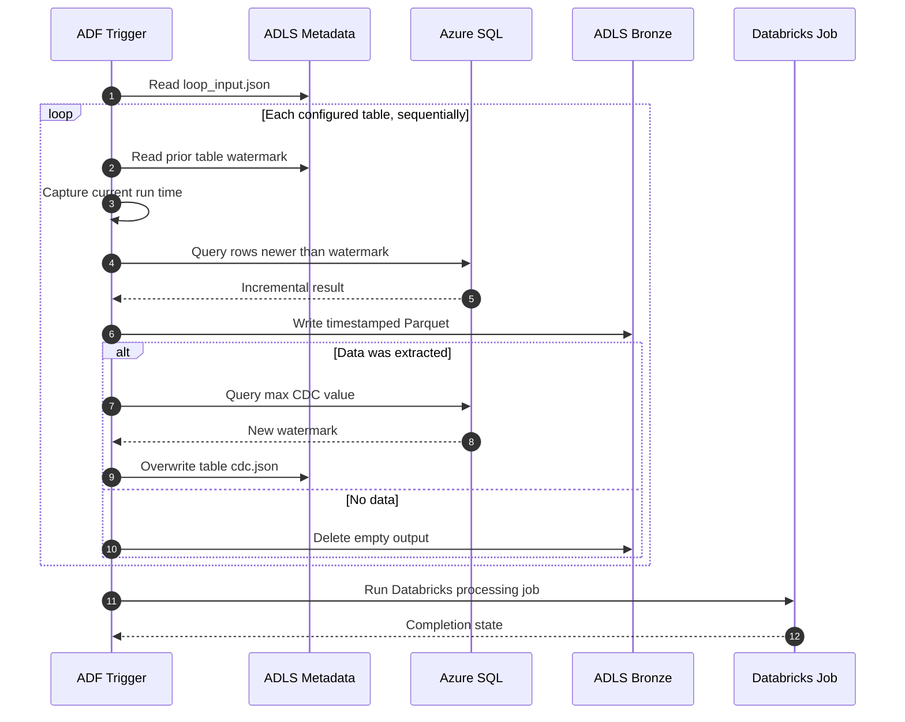
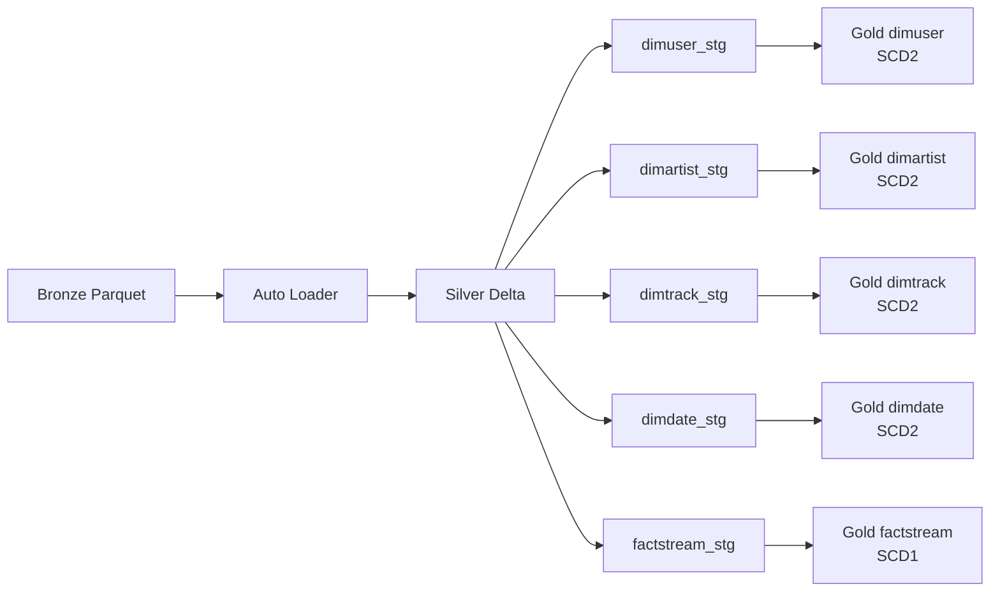

# Architecture

## System context

## Detailed component architecture

## Orchestration sequence

## Databricks processing lineage

## Responsibility boundaries

| Component | Responsibility |
|---|---|
| Azure SQL | Source-of-record tables and CDC columns |
| ADF metadata | Declares which tables and columns participate |
| ADF pipeline | Extracts deltas, advances watermarks, and triggers processing |
| ADLS Bronze | Stores source-aligned incremental files and control state |
| Auto Loader | Discovers new files and tracks schema/checkpoint state |
| Silver PySpark | Cleans names, derives duration bands, deduplicates, and writes Delta |
| Gold Lakeflow | Enforces required IDs and applies SCD behavior |
| Unity Catalog | Provides governed table namespaces |
| Asset Bundle | Defines environment deployment targets |

## Failure boundaries

- A missing control file prevents the metadata lookup or watermark lookup from succeeding.
- Failure in one sequential table iteration stops later tables and prevents the Databricks job.
- A successful extract followed by failed watermark update may cause the same rows to be extracted again.
- Advancing a watermark too far can skip rows; see [Incremental ingestion](INCREMENTAL_INGESTION.md).
- Auto Loader checkpoint loss can cause replay behavior.
- Invalid Gold business keys are dropped by expectations.
