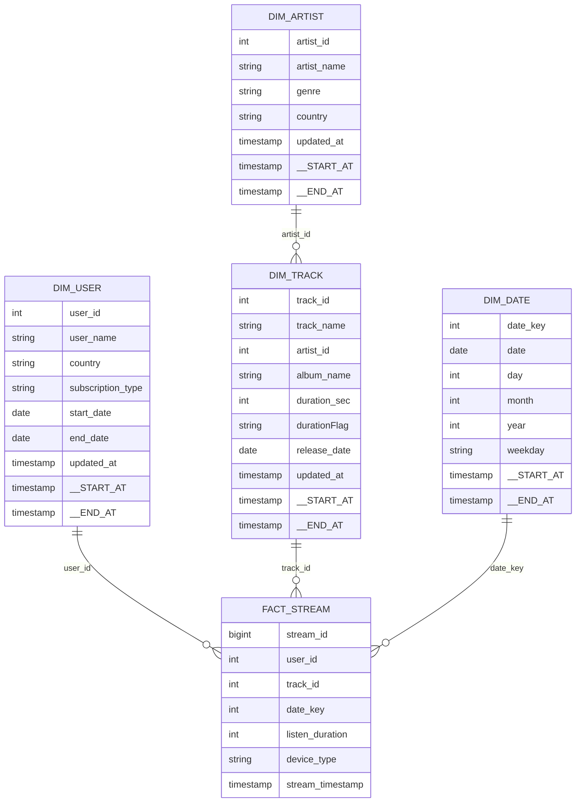

# Data model

## Spotify analytical star schema



## Gold table grains

| Table | Grain | Gold history |
|---|---|---|
| `dimuser` | One row per user version | SCD Type 2 by `updated_at` |
| `dimartist` | One row per artist version | SCD Type 2 by `updated_at` |
| `dimtrack` | One row per track version | SCD Type 2 by `updated_at` |
| `dimdate` | One row per date version | SCD Type 2 by `date` |
| `factstream` | One current row per stream event | SCD Type 1 by `stream_timestamp` |

## Track duration classification

| Rule | `durationFlag` |
|---|---|
| `duration_sec < 150` | `low` |
| `150 <= duration_sec < 300` | `medium` |
| `duration_sec >= 300` | `high` |

## Example analytics

```sql
SELECT
  a.artist_name,
  COUNT(*) AS streams,
  SUM(f.listen_duration) AS listening_seconds
FROM spotify_catalog.gold.factstream AS f
JOIN spotify_catalog.gold.dimtrack AS t
  ON f.track_id = t.track_id AND t.__END_AT IS NULL
JOIN spotify_catalog.gold.dimartist AS a
  ON t.artist_id = a.artist_id AND a.__END_AT IS NULL
GROUP BY a.artist_name
ORDER BY listening_seconds DESC
LIMIT 20;
```

## Modeling considerations

- Historical reporting should join facts to the dimension version effective at stream time, not always the current version.
- `DimDate` usually behaves as a static dimension; Type 2 may be unnecessary unless calendar attributes can change.
- Add relationship tests for fact user, track, and date keys.
- Define whether `listen_duration` is seconds and document valid ranges.
- Consider a dedicated album dimension if album-level analysis grows.
