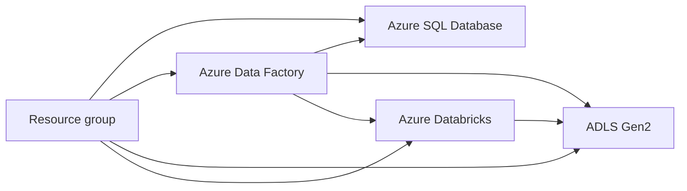

# Deployment and operations

## Azure resources



## Deployment checklist

1. Create Azure SQL and run the initial-load SQL script.
2. Create Bronze, Silver, and Gold ADLS containers.
3. Upload the metadata and initial watermark control files.
4. Grant ADF read access to SQL and read/write access to ADLS.
5. Grant ADF permission to run the Databricks job.
6. Import and parameterize ADF linked services, datasets, pipelines, and triggers.
7. Create `spotify_catalog.silver` and `spotify_catalog.gold`.
8. Configure Databricks access to all ADLS containers.
9. Validate and deploy the Asset Bundle.
10. Configure the Databricks job referenced by ADF.
11. Run the ADF pipeline manually and validate every layer.
12. Enable an appropriate production trigger and monitoring.

## Environment parameters

Move these committed environment-specific values into parameters or deployment variables:

- Azure SQL server and database
- ADLS account and container names
- Databricks workspace host and resource ID
- Databricks job ID
- Cluster runtime, worker count, and node type
- Unity Catalog catalog/schema names
- ADF schedule and time zone

## Databricks Asset Bundle

```bash
cd spotify_dab/spotify_dab
databricks bundle validate -t dev
databricks bundle deploy -t dev
```

The bundle currently provides `dev` and `prod` targets. Add `resources.jobs` and `resources.pipelines` entries so deployment creates the job that ADF invokes rather than relying on a manually configured numeric ID.

## Smoke tests

### ADF

- `Lookup_loop_input` returns all five metadata entries.
- Every `last_cdc` lookup returns one valid value.
- Copy activity input rows and output rows reconcile.
- Empty extracts are deleted.
- Successful non-empty extracts advance only their own table watermark.
- Databricks starts only after the `ForEach` succeeds.

### Databricks

```sql
SELECT COUNT(*) FROM spotify_catalog.silver.DimUser;
SELECT COUNT(*) FROM spotify_catalog.silver.DimArtist;
SELECT COUNT(*) FROM spotify_catalog.silver.DimTrack;
SELECT COUNT(*) FROM spotify_catalog.silver.DimDate;
SELECT COUNT(*) FROM spotify_catalog.silver.FactStream;
```

## Monitoring

- ADF trigger, pipeline, activity, and table-iteration failures
- Source rows read versus sink rows written
- Watermark before/after values
- ADLS file counts and unexpected zero-byte files
- Auto Loader backlog and checkpoint progress
- `_rescued_data` presence before it is dropped
- Silver duplicates and Gold expectation failures
- SCD insert/update counts and current-version uniqueness
- Fact-to-dimension orphan counts
- Databricks job duration and cluster startup time

## Recovery

- To replay a table, set its `from_date` or carefully move its stored watermark backward.
- Replays can duplicate Silver append records unless downstream processing is idempotent.
- Preserve checkpoints unless a deliberate full replay is planned.
- If an extract succeeded but its watermark update failed, rerunning may re-extract the same source rows.
- If a watermark advanced without a complete extract, restore the previous value and replay the bounded interval.
