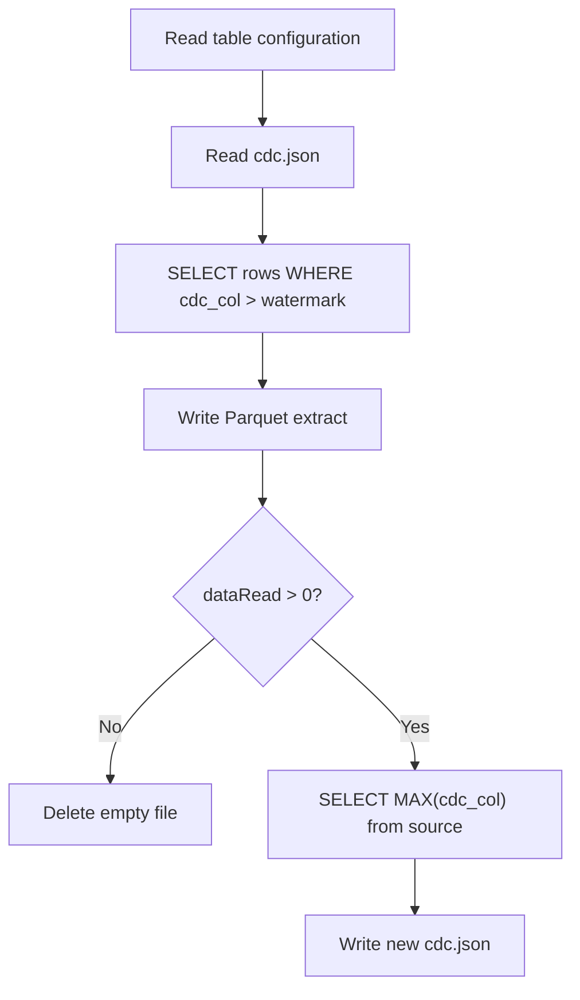
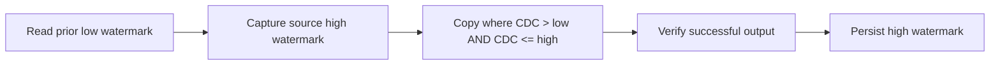

# Incremental ingestion and watermarks

## Metadata-driven configuration

`loop_input.json` drives the ADF `ForEach` activity:

| Table | CDC column |
|---|---|
| `DimUser` | `updated_at` |
| `DimTrack` | `updated_at` |
| `DimDate` | `date` |
| `DimArtist` | `updated_at` |
| `FactStream` | `stream_timestamp` |

Each item may include `from_date` to override the stored watermark for a controlled backfill.

## Current algorithm



The query uses `from_date` when it is non-empty; otherwise it reads `activity('last_cdc').output.value[0].cdc`.

## Storage layout

```text
bronze/
├── Database_tables_input/
│   └── loop_input.json
├── DimUser/
│   └── DimUser_<run timestamp>.parquet
├── DimUser_cdc/
│   └── cdc.json
├── DimArtist/ ...
├── DimTrack/ ...
├── DimDate/ ...
└── FactStream/ ...
```

## Safer bounded-window pattern

The current pipeline queries the source maximum after the Copy activity. If rows arrive between the Copy query and that later maximum query, the watermark can advance past rows that were never copied.

A safer pattern captures an upper bound before extraction:



Example predicate:

```sql
SELECT *
FROM dbo.DimUser
WHERE updated_at >  @low_watermark
  AND updated_at <= @high_watermark;
```

This creates a deterministic half-open processing window. The next run begins strictly after the prior high watermark.

## Reliability recommendations

- Store run ID, low watermark, high watermark, source row count, copied row count, and status in an audit table.
- Use typed parameters rather than interpolated date strings where possible.
- Validate that every CDC column is non-null and indexed at the source.
- Define a deterministic tie-breaker when multiple rows can share the same timestamp.
- Add retries for transient SQL, storage, and Databricks failures.
- Make watermark updates conditional on verified Copy success.
- Keep source retention longer than the maximum recovery window.
- Use separate control locations and resources for dev, test, and production.
